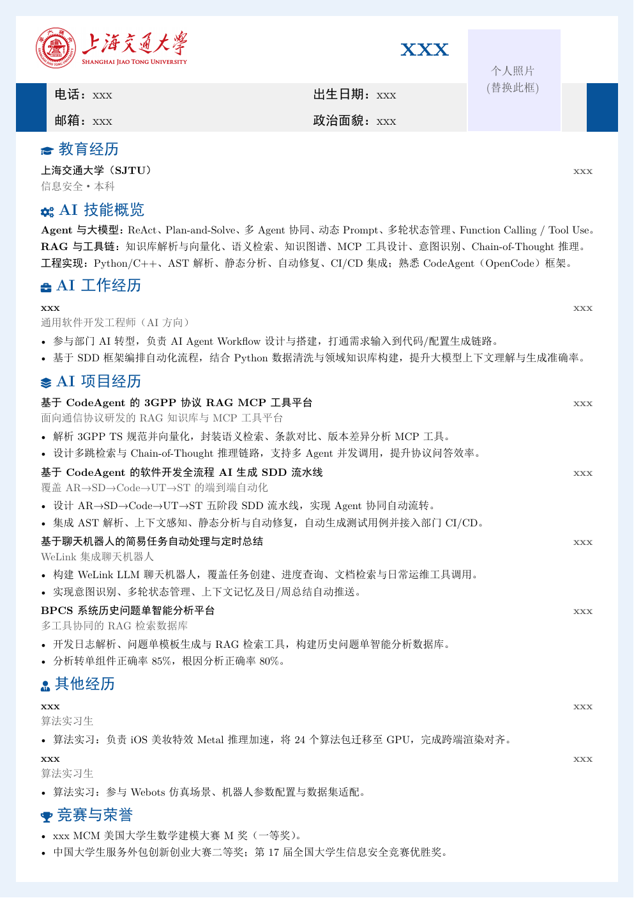

# 上海交通大学 SJTU 学生简历 LaTeX 模板



## 项目简介

这是一个参考上海交通大学视觉风格制作的中文 LaTeX 学生简历模板。模板包含校徽、蓝色分节标题、灰色信息栏、照片占位框和一页式排版，可直接修改内容后使用 XeLaTeX 编译。

This repository provides a Chinese LaTeX student-resume template inspired by Shanghai Jiao Tong University visual identity. It includes a logo header, blue section headings, a gray contact band, a photo placeholder, and a compact one-page layout. Edit the content and compile with XeLaTeX.

## 文件说明 / Files

- `sjtu_resume_anonymous.tex`：匿名示例简历源文件 / anonymized example resume source
- `sjtu_resume_anonymous.pdf`：编译后的 PDF / compiled PDF
- `preview.png`：编译后的页面预览 / rendered preview
- `sjtu_brand_cropped.png`：校徽与中英文校名图片 / SJTU brand image

## 编译 / Compile

```powershell
xelatex -interaction=nonstopmode sjtu_resume_anonymous.tex
```

要求：安装支持中文的 XeLaTeX 环境（推荐 TeX Live 或 MiKTeX）。

Requirement: a XeLaTeX environment with Chinese font support, such as TeX Live or MiKTeX.

## 隐私说明 / Privacy

仓库中的匿名示例使用“克劳德”作为姓名，电话为 `xxxxxxxxxxx`，邮箱为 `xxxxxx@sjtu.edu.cn`，出生日期为 `20xx.xx.xx`，政治面貌为“中共党员”；公司名称使用 `xxx`，经历时间使用 `xxxx.xx-xxxx.xx` 或 `xxxx.xx-至今`。校徽、学校名称和克劳德·香农头像保留，用于完整展示模板版式。

The anonymized example uses “克劳德” as the name, `xxxxxxxxxxx` as the phone, `xxxxxx@sjtu.edu.cn` as the email, `20xx.xx.xx` as the birth date, and “中共党员” as the political affiliation. Company names use `xxx`, and experience dates use `xxxx.xx-xxxx.xx` or `xxxx.xx-至今`. The logo, university name, and Claude Shannon portrait are retained to demonstrate the complete layout.

## 许可 / License

模板代码可用于个人学习、求职和简历排版。校徽与品牌图片仅用于模板展示，请遵守上海交通大学相关视觉识别规范。

The template code may be used for personal learning, job applications, and resume typesetting. The university logo and brand image are included for template demonstration; follow the relevant SJTU visual identity guidelines.
